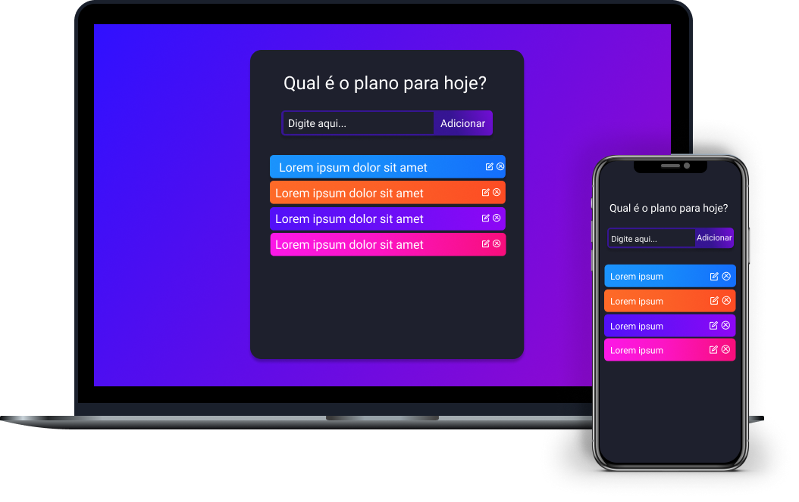

<h1 align="center">
    
</h1>

  <a href="#-tecnologias">Tecnologias</a>&nbsp;&nbsp;&nbsp;|&nbsp;&nbsp;&nbsp;
  <a href="#-projeto">Projeto</a>&nbsp;&nbsp;&nbsp;|&nbsp;&nbsp;&nbsp;
  <a href="#-layout">Layout</a>&nbsp;&nbsp;&nbsp;|&nbsp;&nbsp;&nbsp;
  <a href="#memo-licença">Licença</a>

 

  

 

  

## 🚀 Tecnologias

Esse projeto foi desenvolvido com as seguintes tecnologias:
- [Yarn](https://yarnpkg.com/)
- [Node.js](https://nodejs.org/en/)
- [React](https://reactjs.org)
- [Hooks](https://pt-br.reactjs.org/docs/hooks-intro.html)
- [JavaScript](https://www.javascript.com/)

## 💻 Projeto

O Todo List é uma aplicação para listar suas tarefas diárias e possa realizar controle e planejamento.

## 🔖 Layout

No link abaixo você encontra o layout do projeto web. Lembrando que você precisa ter uma conta no [Figma](http://figma.com/) para acessá-lo.

- [Layout Web](https://www.figma.com/file/WuD315aTHGGGjKMa1sc3Xd/TODO-List)

## :memo: Licença

Esse projeto está sob a licença MIT. Veja o arquivo [LICENSE](LICENSE.md) para mais detalhes. 
Feito com 💜 by Murilo Carvalho
